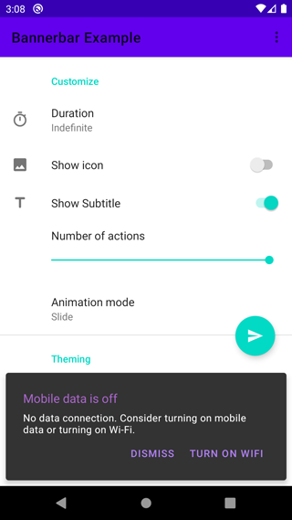
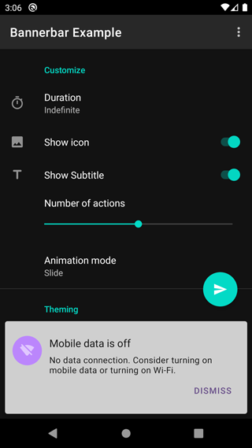

[](https://www.travis-ci.com/github/hendraanggrian/bannerbar/)
[](https://search.maven.org/artifact/com.hendraanggrian.material/bannerbar/)

# Bannerbar




Bannerbar is essentially a [material banner](https://material.io/components/banners/) displayed like a snackbar.
Imagine it as a dialog that doesn't interrupt the whole Activity.

- Following material guidelines, it can only have up to **2 actions**.
- Title are always present, icon and subtitle are optional.
- Shares Snackbar styles and abilities: respects floating action button position, dismissible by a swipe, etc.

### Caveats

Since it uses a lot of Snackbar resources and API, there are a few:

- Only safe to use with the same version of material components.
- Deceptive package name.

## Download

This library follows [AndroidX's revisions](https://developer.android.com/topic/libraries/support-library/androidx-rn/).

```gradle
repositories {
    mavenCentral()
    google()
}
dependencies {
    implementation "com.google.android.material:material:$version"
    implementation "com.hendraanggrian.material:bannerbar:$version"
    implementation "com.hendraanggrian.material:bannerbar-ktx:{version}" // optional Kotlin extensions
}
```

Snapshots of the development version are available in [Sonatype's snapshots repository](https://s01.oss.sonatype.org/content/repositories/snapshots/).

## Usage

Bannerbar usage is similar to Snackbar.

```kotlin
Bannerbar.make(parent, "No internet connection", Bannerbar.LENGTH_INDEFINITE)
    .setIcon(R.drawable.my_image)
    .addAction("Retry") { }
    .show()
```

With `bannerbar-ktx`, this process can be quicker.

```kotlin
parent.bannerbar("No internet connection") {
    setIcon(R.drawable.my_image)
    addAction("Retry") { }
}
```
